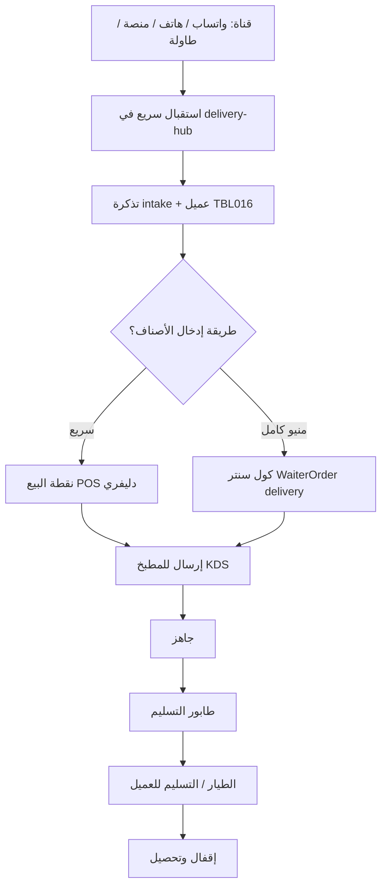

# دليل تشغيل الدليفري والكول سنتر — من البداية للنهاية

> وثيقة للكاشير ومدير التشغيل والمطوّر — تشرح **كيف** يعمل استقبال طلبات التوصيل يوماً بيوم، وما الفرق بين الشاشات، وما المسار من المكالمة/الواتساب حتى خروج الطيار.

---

## 1) الفكرة في سطر

> **تذكرة دليفري** = بيانات العميل + القناة + الشحن/الضريبة، ثم **طلب أصناف** عبر كول سنتر أو نقطة البيع، ثم **مطبخ**، ثم **طابور تسليم** للطيار.

حالات التذكرة (تشغيلياً):

`intake` → `ordering` → `kitchen` → `out_for_delivery` → `delivered` | `cancelled`

---

## 2) الشاشات والمسارات (كاشير)

| الشاشة في القائمة | المسار | ماذا تفعل |
|---|---|---|
| **كول سنتر (طلب دليفري)** | `/app/cashier/call-center` | منيو كامل مثل الجرسون على قناة `delivery` — اختيار أصناف وإرسال للمطبخ مباشرة بعد ربط العميل |
| **إدارة الدليفري** | `/app/cashier/delivery-management` | يوجّه إلى مركز الدليفري على تبويب **طابور التسليم** |
| **مركز الدليفري** (مباشر) | `/app/cashier/delivery-hub` | مكان واحد: استقبال سريع · التذاكر · تحويل من طاولة · طابور التسليم |
| **نقطة البيع** | `/app/cashier/pos?orderType=delivery&…` | فاتورة دليفري سريعة (شحن / بدون ضريبة / ربط تذكرة) |

نفس المسارات متاحة لـ المدير / مدير التشغيل / المطوّر تحت `/app/{role}/…`.

### تبويبات مركز الدليفري (`delivery-hub`)

| تبويب | الاستخدام |
|---|---|
| **استقبال سريع** | واتساب / مكالمة / منصة — بحث عميل — حفظ تذكرة — فتح POS |
| **التذاكر** | كل التذاكر المفتوحة؛ إعادة فتح نقطة البيع لأي تذكرة |
| **من طاولة → دليفري** | ضيف على طاولة يريد توصيل الطلب للمنزل |
| **طابور التسليم** | طلبات بحالة جاهز من المطبخ + بيانات المستلم/الطيار |

رابط داخل المركز: **شاشة الطلب الكاملة** → كول سنتر.

---

## 3) الأدوار وما يفعله كل دور

| الدور | استقبال تذكرة | كول سنتر / طلب أصناف | تحويل طاولة | متابعة طابور التسليم | تسديد / إقفال |
|---|:-:|:-:|:-:|:-:|:-:|
| **كاشير** | ✓ | ✓ | ✓ | ✓ | ✓ |
| **مدير / مدير تشغيل / مطوّر** | ✓ | ✓ | ✓ | ✓ | ✓ |
| **محاسب** | ✓ (مركز) | عبر POS إن لزم | — | قراءة | تقارير |
| **مطبخ** | — | يستقبل الطلب على KDS | — | يعلّم جاهز | — |
| **طيار / مناولة** | — | — | — | يستلم من الطابور حسب إعداد `deliverFromKitchenBy` | — |

---

## 4) الدورة الأساسية — من المكالمة/الواتساب حتى التسليم

### المشهد
عميل يتصل أو يرسل واتساب يطلب توصيلاً لمنطقة المعادي.

### الخطوة 1 — فتح الاستقبال (كاشير)

1. دخول كاشير → القائمة → **إدارة الدليفري** أو افتح مباشرة `/app/cashier/delivery-hub?tab=intake`
2. اختر القناة: **واتساب** أو **مكالمة / كول سنتر** أو **منصة**
3. ابحث بالاسم أو الهاتف أو المنطقة (بحث ذكي)
4. إن وُجد العميل: اختره من النتائج (يُملأ الاسم/الهاتف/العنوان)
5. إن كان جديداً: املأ **الاسم + الهاتف + المنطقة** (إلزامي)
6. اختياري: عنوان تفصيلي · موعد التسليم · قيمة الشحن · اسم الطيار · نص المطلوب · مواصفات · صورة محادثة · GPS
7. للدليفري غالباً فعّل **بدون ضريبة**
8. للمنصة: اسم المنصة + رقم الأوردر + الرابط إن وُجد

**ما يحدث في النظام:**

- `POST /api/restaurant/delivery/intake`
- إنشاء/تحديث عميل في `TBL016` (Agent)
- حفظ تذكرة في `config/restaurant/delivery_tickets.json` بحالة `intake`
- رفع صورة اختيارية عبر `/api/restaurant/delivery/tickets/{id}/attachment`

### الخطوة 2أ — مسار سريع: حفظ وافتح نقطة البيع

1. من الاستقبال اضغط **حفظ وافتح نقطة البيع**
2. تُفتح `/app/cashier/pos` بمعاملات التذكرة (عميل، شحن، بدون ضريبة، `deliveryTicketId`)
3. أدخل الأصناف → أكّد الطلب → يُرسل للمطبخ
4. عند الحاجة يُحدَّث/يُربط العميل عبر `POST /api/agents/delivery-upsert`

### الخطوة 2ب — مسار كول سنتر (منيو كامل)

1. من القائمة: **كول سنتر (طلب دليفري)** أو من المركز رابط **شاشة الطلب الكاملة**
2. شاشة طلب كاملة (واجهة الجرسون) بقناة `delivery`
3. اربط العميل (بحث/اختيار Agent) ثم أضف الأصناف والشرائح
4. أرسل للمطبخ كما في طلب الطاولة

> استخدم **كول سنتر** عندما تريد منيوّاً كاملاً وتعديلات دقيقة.  
> استخدم **POS** عندما الطلب بسيط وسريع بعد تذكرة الاستقبال.

### الخطوة 3 — المطبخ

1. يظهر الطلب على شاشة المطبخ `/app/kitchen/kitchen` (أو الطابعة حسب إعدادات KDS)
2. الشيف يجهّز البنود ويعلّمها **جاهز**

### الخطوة 4 — طابور التسليم

1. الكاشير يفتح **إدارة الدليفري** (أو `delivery-hub?tab=queue`)
2. تظهر الطلبات الجاهزة مع اسم العميل / الهاتف / المنطقة / الطيار إن وُجد
3. يُسلَّم الطلب للطيار ويُتابع حتى التسليم للعميل
4. المصدر: `GET /api/restaurant/orders/delivery-queue` (طلبات `ready` مُثرى بتذكرة الدليفري)

### الخطوة 5 — الإقفال المالي

- تُسدَّد فاتورة الدليفري من نقطة البيع / مسار الفواتير حسب سياسة التحصيل في الفرع
- الشحن يُضاف لإجمالي الدليفري عند تفعيله في POS
- بدون ضريبة يُطبَّق عندما تكون التذكرة/الطلب معلّمة `noVat`

---

## 5) سيناريو المنصة (طلباتي / مرسول / …)

1. القناة = **منصة**
2. املأ اسم المنصة ورقم الأوردر والصورة/الرابط
3. احفظ التذكرة → افتح POS أو كول سنتر لنسخ الأصناف من لقطة الشاشة
4. الشحن والضريبة حسب اتفاق المنصة (غالباً بدون ضريبة على قناة الدليفري الداخلية)
5. تابع من **التذاكر** ثم **طابور التسليم** بعد جاهزية المطبخ

---

## 6) سيناريو تحويل طاولة → دليفري

> ضيف أكل في الصالة ثم طلب إرسال باقي الطلب أو طلباً جديداً للمنزل.

1. من المركز → تبويب **من طاولة → دليفري**  
   أو من لوحة الكاشير رابط التحويل إلى `delivery-hub?tab=convert`
2. اختر الجلسة النشطة → **حوّل إلى دليفري**
3. أدخل اسم المستلم + الهاتف + المنطقة
4. النظام يستدعي `POST /api/restaurant/table-sessions/{id}/convert-to-delivery`:
   - ينشئ تذكرة بقناة `table_convert`
   - يعلّم الجلسة `channel=delivery` ويربط `deliveryTicketId`
5. أكمل الأصناف إن لزم من POS/كول سنتر ثم المطبخ ثم الطابور

> لا يُسمح بالتحويل إذا كانت الجلسة بانتظار الدفع (`awaitingPayment`).

---

## 7) سيناريو «تذكرة فقط ثم طلب لاحقاً»

1. من الاستقبال: **حفظ التذكرة فقط** (بدون فتح POS فوراً)
2. لاحقاً من تبويب **التذاكر** → **فتح نقطة البيع**
3. مفيد عند ضغط المكالمات: تسجّل البيانات أولاً ثم تُدخل الأصناف عند هدوء الشاشة

---

## 8) مخطط التدفق المختصر

---

## 9) حقول إلزامية وتشغيلية

| الحقل | إلزامي؟ | ملاحظة |
|---|:-:|---|
| الاسم | ✓ | للاستقبال |
| الهاتف 1 | ✓ | للاستقبال |
| المنطقة | ✓ | للاستقبال |
| العنوان التفصيلي | مُفضَّل | يظهر في الطابور |
| قيمة الشحن | اختياري | تُمرَّر لـ POS |
| بدون ضريبة | افتراضي غالباً ✓ | سياسات الفرع |
| اسم الطيار | مُفضَّل قبل الخروج | يظهر في الطابور |
| صورة المحادثة | مُفضَّلة لواتساب/منصة | **لصق مباشر** `Ctrl+V` بعد سكرين الديسكتوب، أو سحب، أو اختيار ملف |
| GPS | اختياري | يُحفظ مع التذكرة |

---

## 10) APIs الأساسية

| API | الغرض |
|---|---|
| `POST /api/restaurant/delivery/intake` | إنشاء تذكرة + upsert عميل |
| `GET /api/restaurant/delivery/tickets` | قائمة التذاكر |
| `POST /api/restaurant/delivery/tickets/{id}/attachment` | صورة محادثة/منصة |
| `PATCH /api/restaurant/delivery/tickets/{id}` | تحديث حالة/بيانات |
| `POST /api/restaurant/table-sessions/{id}/convert-to-delivery` | تحويل جلسة طاولة |
| `GET /api/restaurant/orders/delivery-queue` | طابور الجاهز للتسليم |
| `POST /api/agents/delivery-upsert` | ربط/تحديث عميل من POS |

ملفات التشغيل المحلية (لا تُرفع لـ GitHub):

- `config/restaurant/delivery_tickets.json`
- `config/restaurant/delivery_attachments/`

---

## 11) أعطال شائعة سريعة

| العرض | السبب المحتمل | ماذا تفعل |
|---|---|---|
| لا تظهر عناصر كول سنتر/إدارة للكاشير | قائمة قديمة في المتصفح | حدّث الصفحة؛ تأكد من دخول دور كاشير |
| «مطلوب: الاسم + الهاتف + المنطقة» | حقل ناقص في الاستقبال | أكمل الثلاثة قبل الحفظ |
| طابور التسليم فارغ رغم جاهزية المطبخ | الطلب ليس `ready` أو فلتر الدور في `deliverFromKitchenBy` | راجع حالة الطلب على KDS وإعداد دورة العمل |
| التحويل من طاولة معطّل | الجلسة بانتظار الدفع | أنهِ/ألغِ طلب الحساب أولاً أو أكمل التسديد حسب السياسة |
| العميل لا يُحفظ | انقطاع SQL / فشل upsert | تحقق من اتصال القاعدة ثم أعد الحفظ |

---

## 12) قائمة تحقق يومية للكاشير

1. افتح **مركز/إدارة الدليفري** في بداية الوردية
2. راقب تبويب **التذاكر** للمعلّق بدون أصناف
3. استخدم **كول سنتر** للطلبات المفصّلة و**POS** للسريع
4. قبل خروج الطيار: راجع **طابور التسليم** (اسم · هاتف · منطقة · طيار)
5. ارفع صور الواتساب/المنصة مع التذكرة لتقليل النزاعات
6. عند تحويل من الصالة: سجّل هاتف المستلم الحقيقي وليس رقم وهمي إلا اضطراراً

---

*آخر تحديث تشغيلي: 2026-07-27 — متوافق مع مركز الدليفري الموحّد + ظهور كول سنتر وإدارة الدليفري في قائمة الكاشير.*
