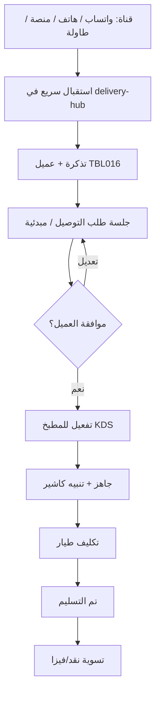

# دليل تشغيل الدليفري والكول سنتر — من البداية إلى النهاية

> وثيقة للكاشير ومدير التشغيل والمطوّر — تشرح **كيف** يعمل استقبال طلبات التوصيل يومياً، وما الفرق بين الشاشات، وما المسار من المكالمة/الواتساب حتى خروج الطيار.

---

## 1) الدليفري في سطر واحد

تذكرة التوصيل تحتفظ بالعميل، والقناة، والمرفقات، وتتبع الحالة. تُفتح جلسة طلب توصيل مخصصة لإدخال السلة، وإنشاء عرض مبدئي، وتفعيل المطبخ. هذا المسار لا يستخدم Waiter POS.

الحالات: `intake` / `draft_quote` -> `quoted` -> `kitchen` -> `ready` -> `out_for_delivery` -> `delivered` -> `settled` | `cancelled`.

## 2) الشاشات والمسارات

- مركز الدليفري (`/app/cashier/delivery-hub`): استقبال الطلبات، والتذاكر، وتحويل الطاولات، وطابور التوزيع.
- جلسة طلب التوصيل (`/app/cashier/delivery-order`): بحث العميل، والمنيو، والمفضلة، والإضافات، والسلة، والعرض، والتفعيل.
- طابور التوزيع: يعرض تذاكر الجاهز وفي الطريق مع صفوف KDS المرتبطة، لتعيين الطيار وتأكيد التسليم والتسوية.

## 3) الأدوار

الكاشير، والمدير، ومدير التشغيل، والمطوّر يمكنهم استقبال الطلب، وبناء السلة، وتحويل الطاولة، وتشغيل طابور التوصيل. يصل إلى المطبخ فقط الطلب المفعّل ليعلمه جاهزاً. يستلم الطيار الطلب المعيّن له ويكمل تتبع التسليم.

## 4) دورة التشغيل

1. واتساب: أنشئ التذكرة، وأرفق المحادثة عند توفّرها، وابن عرضاً مبدئياً، ثم أرسل/انسخ نص العرض. لا تُفعّل الطلب للمطبخ إلا بعد موافقة العميل.
2. كول سنتر: تفتح تذكرة الهاتف السلة مباشرة. اختر مجموعات الإضافات المرتبطة بكل صنف؛ وتُحفظ أسماؤها وأسعارها في سطر السلة، ثم اتبع نفس حلقة العرض ثم المطبخ.
3. الموقع/المنصة: سجّل بيانات التذكرة، ونص الطلب المطلوب، والمرفقات، ثم ابن السلة واتبع نفس دورة المطبخ.
4. تحويل طاولة ينشئ تذكرة توصيل مرتبطة بالعميل والصور والتتبع. أكملها في جلسة التوصيل، ولا تستخدم Waiter POS.
5. بعد التفعيل يجهّز KDS الطلب؛ ويعيّن التوزيع طياراً، ويسجّل التسليم والتسوية.

---

## 5) سيناريو المنصة (طلباتي / مرسول / …)

1. القناة = **منصة**
2. املأ اسم المنصة ورقم الأوردر والصورة/الرابط
3. احفظ التذكرة → افتح **جلسة طلب التوصيل** لنسخ الأصناف من لقطة الشاشة
4. الشحن والضريبة حسب اتفاق المنصة (غالباً بدون ضريبة على قناة الدليفري الداخلية)
5. فعّل للمطبخ بعد التأكيد، ثم تابع من **التذاكر** و**طابور التسليم**

---

## 6) سيناريو تحويل طاولة → دليفري

> ضيف أكل في الصالة ثم طلب إرسال باقي الطلب أو طلباً جديداً للمنزل.

1. من المركز → تبويب **من طاولة → دليفري**  
   أو من لوحة الكاشير رابط التحويل إلى `delivery-hub?tab=convert`
2. اختر الجلسة النشطة → **حوّل إلى دليفري**
3. أدخل اسم المستلم + الهاتف + المنطقة
4. النظام يستدعي `POST /api/restaurant/table-sessions/{id}/convert-to-delivery`:
   - ينشئ تذكرة بقناة `table_convert`
   - يعلّم الجلسة `channel=delivery` ويربط `deliveryTicketId`
5. أكمل الأصناف في جلسة التوصيل، ثم فعّل الطلب وتابعه في الطابور

> لا يُسمح بالتحويل إذا كانت الجلسة بانتظار الدفع (`awaitingPayment`).

---

## 7) سيناريو «تذكرة فقط ثم طلب لاحقاً»

1. من الاستقبال: **حفظ التذكرة فقط** (بدون فتح الجلسة فوراً)
2. لاحقاً من تبويب **التذاكر** → **فتح جلسة الطلب**
3. مفيد عند ضغط المكالمات: تسجّل البيانات أولاً ثم تُدخل الأصناف عند هدوء الشاشة

---

## 8) مخطط التدفق المختصر

---

## 9) حقول إلزامية وتشغيلية

| الحقل | إلزامي؟ | ملاحظة |
|---|:-:|---|
| الاسم | ✓ | للاستقبال |
| الهاتف 1 | ✓ | للاستقبال |
| المنطقة | ✓ | للاستقبال |
| العنوان التفصيلي | مُفضَّل | يظهر في الطابور |
| قيمة الشحن | اختياري | تُمرَّر لجلسة التوصيل |
| بدون ضريبة | افتراضي غالباً ✓ | سياسات الفرع |
| اسم الطيار | مُفضَّل قبل الخروج | يظهر في الطابور |
| صورة المحادثة | مُفضَّلة لواتساب/منصة | **لصق مباشر** `Ctrl+V` بعد سكرين الديسكتوب، أو سحب، أو اختيار ملف |
| رابط خرائط جوجل | مُفضَّل | لصق `maps.app.goo.gl/…` أو رابط كامل — يُحفظ مع التذكرة ويُستخرج GPS إن أمكن |
| التحصيل | COD / مسبق / جزئي | دفعة مسبقة قبل الطلب تُخصم من المتبقي عند التسليم |
| الشحن | من أصناف مجموعة **خدمات الشحن** في TBL006 → TBL007 | اختر «شحن الهرم / المقطم…»؛ يُسجل كبند فاتورة بالصنف المختار |
| GPS | اختياري | يُحفظ مع التذكرة |

---

## 10) APIs الأساسية

| API | الغرض |
|---|---|
| `POST /api/restaurant/delivery/intake` | إنشاء تذكرة + upsert عميل |
| `GET /api/restaurant/delivery/tickets` | قائمة التذاكر |
| `POST /api/restaurant/delivery/tickets/{id}/attachment` | صورة محادثة/منصة |
| `PATCH /api/restaurant/delivery/tickets/{id}` | تحديث حالة/بيانات |
| `POST /api/restaurant/table-sessions/{id}/convert-to-delivery` | تحويل جلسة طاولة |
| `GET /api/restaurant/orders/delivery-queue` | طابور الجاهز للتسليم |
| `POST /api/agents/delivery-upsert` | ربط/تحديث عميل الدليفري |

ملفات التشغيل المحلية (لا تُرفع لـ GitHub):

- `config/restaurant/delivery_tickets.json`
- `config/restaurant/delivery_attachments/`

---

## 11) أعطال شائعة سريعة

| العرض | السبب المحتمل | ماذا تفعل |
|---|---|---|
| لا تظهر عناصر كول سنتر/إدارة للكاشير | قائمة قديمة في المتصفح | حدّث الصفحة؛ تأكد من دخول دور كاشير |
| «مطلوب: الاسم + الهاتف + المنطقة» | حقل ناقص في الاستقبال | أكمل الثلاثة قبل الحفظ |
| طابور التسليم فارغ رغم جاهزية المطبخ | الطلب ليس `ready` أو فلتر الدور في `deliverFromKitchenBy` | راجع حالة الطلب على KDS وإعداد دورة العمل |
| التحويل من طاولة معطّل | الجلسة بانتظار الدفع | أنهِ/ألغِ طلب الحساب أولاً أو أكمل التسديد حسب السياسة |
| العميل لا يُحفظ | انقطاع SQL / فشل upsert | تحقق من اتصال القاعدة ثم أعد الحفظ |

---

## 12) قائمة تحقق يومية للكاشير

1. افتح **مركز/إدارة الدليفري** في بداية الوردية
2. راقب تبويب **التذاكر** للمعلّق بدون أصناف
3. استخدم **جلسة التوصيل** لكل القنوات (مبدئية ثم تفعيل)
4. قبل خروج الطيار: راجع **طابور التسليم** (اسم · هاتف · منطقة · طيار)
5. ارفع صور الواتساب/المنصة مع التذكرة لتقليل النزاعات
6. عند تحويل من الصالة: سجّل هاتف المستلم الحقيقي وليس رقم وهمي إلا اضطراراً

---

*آخر تحديث تشغيلي: 2026-07-27 — متوافق مع مركز الدليفري الموحّد + ظهور كول سنتر وإدارة الدليفري في قائمة الكاشير.*
