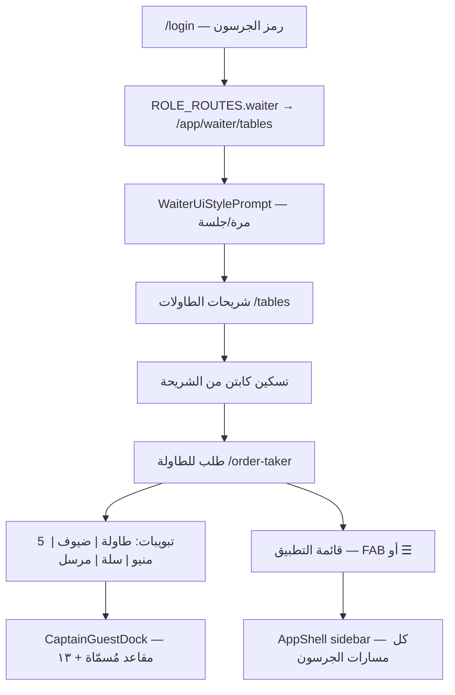

# الوضع النهائي — تنقل جرسون الطلبات (مطاعم)

مرجع ثابت بعد دفعة **captain-mobile + قائمة موحّدة** (مايو 2026). آخر التزام Git على الفرع `dev-next-baseline-2026-05-05`: **`11016ce`**.

---

## 1. الهدف

- **مسار واحد** من تسجيل الدخول حتى الطلب على الطاولة، بدون قوائم مكررة على الجوال.
- **شريحات الطاولات** كنقطة بداية تشغيلية (لا استئناف تلقائي لشاشة الطلب من آخر زيارة).
- على الجوال (عرض ≤ **900px**): **تدفق كابتن** داخل `order-taker` بخمس تبويبات سفلية + شريط ضيوف جانبي **مُصفّى** (أسماء معرّفة + مقعد ١٣ فقط).

---

## 2. مخطط التدفق

---

## 3. المسارات (`/app/waiter/...`)

| المسار | الصفحة | الدور في التدفق |
|--------|--------|------------------|
| `tables` | `WaiterTablesPage` | **البداية** بعد المقدمة — اختيار طاولة، تسكين، Owner/VIP |
| `captain-tables` | `WaiterTablesPage` | نفس الشريحات (مسار بديل للمدير/مطوّر؛ للجرسون يُفضَّل `tables`) |
| `dashboard` | لوحة الصالة | ملخص من القائمة الرئيسية |
| `runner` | استلام من المطبخ | جاهز للتقديم |
| `pos` | طلب سريع (بار) | بدون طاولة — **مخفى من قائمة الجرسون** في `AppShell` (فلتر `pos`) |
| `order-taker` | `WaiterOrderPage` | POS الطاولة — **لا يُفتح من القائمة**؛ من الشريحة فقط |

مصدر عناصر القائمة: `src/lib/waiterNav.ts` → `WAITER_NAV_ITEMS` و`WAITER_HUB_PATH`.

---

## 4. القائمة الرئيسية (واحدة)

| السياق | آلية الفتح |
|--------|------------|
| صالة الجرسون (جوال، ليس fullscreen طلب) | زر عائم **FAB** `.app-shell__menu-fab` → يفتح **نفس** السايدبار |
| داخل `order-taker` (جوال) | زر **☰** في هيدر POS → `AppMenuContext.openAppMenu` |
| سطح مكتب | تبويب جانبي `.app-shell__rail-tab` أو السايدبار المفتوح |

**ما أُزيل:** شريط أيقونات جوال مكرر (`.app-shell__dock`)، تبويب «رئيسية» داخل POS، مكوّن `CaptainHomeMenu.tsx` (قائمة مكررة داخل الطلب).

`AppMenuProvider` في `AppShell` يمرّر `openAppMenu` / `closeAppMenu` = فتح/إغلاق السايدبار.

---

## 5. تدفق الكابتن (جوال ≤ 900px)

**الشرط:** `narrowOtViewport` في `WaiterOrderPage` (`WAITER_OT_NARROW_MAX_PX = 900`) → `useCaptainMobileUi`.

### التبويبات السفلية

| التبويب | المحتوى (أقسام DOM) |
|---------|---------------------|
| `table` | الطاولة، الجلسة، خيارات متقدمة |
| `guests` | تعريف أسماء الضيوف (`waiter-ot-sec-distribute`) |
| `menu` | فئات، بحث، شبكة أصناف |
| `cart` | قيد الإرسال |
| `sent` | مرسل + إجماليات |

التعريف: `src/lib/waiterCaptainMobile.ts` — `CAPTAIN_MOBILE_TABS`, `CAPTAIN_TAB_SECTIONS`.

### شريط الضيوف `CaptainGuestDock`

- يظهر فقط في وضع **طلب لكل ضيف** (`assignmentMode === "per_seat"`) وعلى تبويبات `guests` | `menu` | `cart`.
- المقاعد المعروضة: `captainDockSeatsFromLabels(labels, slotCount, sharedSeatNo)` — أي مقعد له **اسم غير فارغ** + **مقعد ١٣ مشترك** دائماً في النهاية.
- **لا** يعرض المقاعد ١–١٢ الفارغة.
- الضغط على مقعد → يختار المقعد وينتقل لتبويب `menu` (عبر `pickCaptainSeatForOrder`).

### سطح المكتب (> 900px)

- تخطيط POS الكلاسيكي (أعمدة، شريط جانبي للمقاعد إن وُجد `per_seat`).
- لا شريط تبويبات كابتن سفلي.

---

## 6. المقدمة والتخزين المحلي

| المفتاح | الغرض |
|---------|--------|
| `mat3am_waiter_ui_prompt_done_v1` (sessionStorage) | إظهار `WaiterUiStylePrompt` مرة لكل جلسة متصفح |
| `mat3am_order_taker_ui_v2` (localStorage) | قيمة ثابتة `unified` — لا اختيار نموذج ١/٢ على الجوال |
| `mat3am_waiter_last_path_v1` (localStorage) | آخر مسار جرسون — **لا يُستأنف** إذا كان `order-taker`؛ بعد المقدمة → `WAITER_HUB_PATH` |

`waiterPathAfterStylePick()` في `waiterOrderUiPrefs.ts`: يعيد `tables` ما لم يكن آخر مسار صالحاً غير `order-taker`.

---

## 7. ملفات المصدر (خريطة سريعة)

| الملف | الوظيفة |
|-------|---------|
| `src/lib/waiterNav.ts` | مسارات وعناصر قائمة الجرسون |
| `src/lib/waiterCaptainMobile.ts` | تبويبات الكابتن + فلتر مقاعد Dock |
| `src/lib/waiterOrderUiPrefs.ts` | مقدمة، مسار بعد الدخول |
| `src/context/AppMenuContext.tsx` | فتح القائمة من POS |
| `src/components/AppShell.tsx` | سايدبار + FAB + مقدمة |
| `src/components/CaptainGuestDock.tsx` | شريط مقاعد جانبي |
| `src/components/WaiterUiStylePrompt.tsx` | شرح 3 خطوات للتدفق |
| `src/pages/WaiterOrderPage.tsx` | POS + ربط كابتن |
| `src/pages/WaiterTablesPage.tsx` | شريحات الطاولات |
| `src/auth/roles.ts` | `ROLE_ROUTES.waiter` → `/app/waiter/tables` |
| `src/styles/appShell.css` | FAB، إخفاء dock القديم |
| `src/styles/operationalRoles.css` | `.waiter-pos--ot-ui-captain`, Dock |

---

## 8. سجل التعديلات التفصيلي

المدخلات **071–075** في `docs/EDIT_AUDIT_LOG.md` تغطي التطور التدريجي؛ هذا الملف يلخّص **الحالة المستقرة النهائية** بعد دمجها.

---

## 9. تشغيل واختبار سريع

1. `run_full_stack.bat` أو API `2288` + واجهة `9999`.
2. دخول جرسون (`waiter` في `config/restaurant/app_users` أو الرمز التجريبي حسب الإعداد).
3. تأكيد: المقدمة → **شريحات** → تسكين → طلب → على عرض ضيق: 5 تبويبات + ☰ واحد + FAB في الصالة فقط.
4. وضع «لكل ضيف»: سمِّ ضيفاً في تبويب ضيوف → يظهر في Dock والشريط الأفقي أعلى المنيو فقط إن وُجد اسم.

---

## 10. خارج النطاق / لم يُنفَّذ هنا

- إعادة «طلب للطاولة» كبند في قائمة الجرسون (مقصود — الدخول من الشريحة).
- تبويب `home` منفصل داخل POS (أُلغي لصالح قائمة التطبيق).
- معاينة Style 1/2 الإنتاجية: المسار `/preview/waiter-order-ui` للمعاينة فقط.

---

*آخر تحديث للوثيقة: 2026-05-20 — ID سجل `doc-waiter-final-state`*
